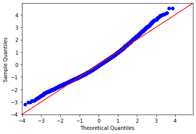
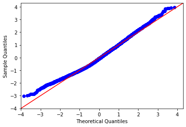
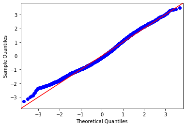

# Hello Homes Expanision Project: Builders Edition
**Author**: Monique Hercules


## Overview
Our stakeholder is a local real estate agency that help homeowners buy/sell homes. After years in the industry they have decided to expand to include the building and flipping of homes as well to better meet there consumer needs and increase revenue.

Today we will use multiple linear regression models to analyze house sales in the Washington state King county area.


## Business Problem
Hello Homes would like to find out what types of homes they would need to build based off of there past sales to meet there consumers needs and increase revenue. They are targeting the most popular price ranges, sqft living, and accommodation preferences like bathrooms,bedrooms and number of floors. 

Today we will provide evidential advice on various aspects of a home to fit the builders needs. By targeting this information the real estate agency will know exactly what types of homes to build for their clients.With the use of multiple linear regression we will be able to accurately  see the relationship between the various attributes of a home and and how they reflect upon the homes worth. 


## Data
This dataset in use will be from King County of Washington State. It will feature various aspects of a home like sqft living, year built and the condition of the home. 


## Methods
Before analyzing the data for Hello Homes to begin modeling the data was prepared in with various methods:

Data Cleaning 
Dropped unnecessary columns to make them easier to work with. Cleaned through the various data by removing Nan variables (when applicable), commas and the symbols and while also converting data types as well as removing outliers. By doing this made made the model more accurate overall. 

Linear Regression 
Used multiple linear regression to accurately study the narrative between the various aspects of a home and how they influence the price.This method will allow for manual manipulations to individual variables and how they affect the price. 

Verifying Assumptions for Linear Regression 
Ensured linearity, normality and multicollinearity are met before modeling 

Preprocessing 
One Hot Encoded chosen categorical variables. Decided against feature scaling to work with numbers in a more natural setting. Normalized my chosen numerical variables to reduce multicollinearity. 


## Modeling 
Chose multiple linear regression to accurately study the narrative between the various aspects of a home and how they influence the price.This method will allow for manual manipulations to individual variables and how they affect the price. Allowing for deeper specification in recommendations.

Used Statsmodel with OLS to model data, with the  use of p values, variance check and homoscedasticity to refine model. 

### Visuals 






## Results
Decided to use the model refinement 3 to draw results from: 
Model 3 had a higher R squared value than model 4 at 0.37 
SQFT 
Is this sqft living per a sqft or overall, The ideal sqft living price range being around $115

Conditions 
Homes that had conditions fair degrades price range by $35,000 while homes with condition very good increase home prices by $65,000. 

Floors 
Lofts, townhouses and three stories homes are the most profitable with floors at 2.5 being the best by increasing the price by $66,000

THe coefficients used are 

## Regression Results 

Model 3 has a R-squared of 0.377 making it the most accurate of the models so far.

***Coefficients***
- The target price per a sqft living is $115. 

- Through out the various levels of a home two story homes degraded the price of a home by 14,000. While 2.5 story homes increase the price by 66,000.Lofts being the ideal by bringing up the price to 74,000.

- The condition of the home influence the price greatly.With the condition of fair bringing down the home value by 35,000 while the condition status of good increases the home value by 22,000. The ideal condition status for homes value is very good increasing the price by 65,000. 

*** Grading scale and influence on price:***
- Grade 3 Poor decreases price by $107,000
- Grade 4 Low decreases price by 117,000
- Grade 5 Fair decreases price by 112,000
- Grade 6 Low Average decreases price by 74,000
- Grade 8 Good increases price by 85,000
- Grade 9 Better increases price by 125,000

Draw Backs:
This model lacks in depth information about bathrooms and bedrooms with bedrooms 3 and 4 being being negative. 


## Conclusions
After doing the analysis, the three recommendations for Hello Homes Building Expanision:

- Build various homes with the grade status 8 and 9 to increase the value of the up to 125,000. Any homes bought within the grades 3-6  will need to to be flipped to be a higher grade than 6 increasing the price value. 

- While all houses flipped/made will also need to meet the condition very good to ensure the price value increases by 65,000.

- Focus on building more lofts, townhouses and three stories homes since they are the most profitable.While targeting price per a sqft at $115. Avoid regular two story homes and instead aim for 2.5 which is the best increasing the price of home by 66,000. 

## Next Steps 
Attributes for Hello Homes to consider for further analysis, based on Model 3: 

Limitations :The model is on the weaker side with a R-squared value of 0.37, preferable we would have a model with a higher r-squared conveying a more accurate model.

Limited Data: Bedrooms and bathrooms are both negative in model 3 as well as lacking options in their respective groups to draw conclusions from. Expand the predictor variables to have more aspects of a home to mix and match for future properties 

Issues with multicollinearity :Even after verifying assumptions for multicollinearity the error still appeared under the models final results, for future use multicollinearity need to be reduced. 

## For More Information
Please review my full analysis in my Jupyter Notebook or my presentation.

For any additional questions, please contact Monique Hercules Email: moniquehercules101@gmail.com


## Repository Structure:
```
├── data                                <- Both sourced externally and generated from code
├── images                              <- Both sourced externally and generated from code
├── Phase_2_Project.ipynb               <- Narrative documentation of analysis in Jupyter notebook
├── Hello_Homes_Expanision_Project.pdf  <- PDF version of project presentation
└── README.md                           <- The top-level README for reviewers of this project
```